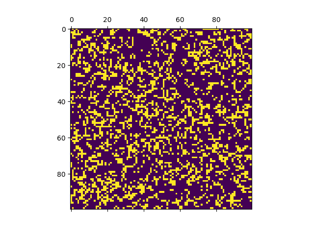

# Projects

|--------------+------------+-----------------+----------------|
|    Project   | Description                                                                                                                                                                                      | Example Output                                                      | Links                  |
|:------------:|:--------------------------------------------------------------------------------------------------------------------------------------------------------------------------------------------------|--------------------------------------------------------------------|------------------------|
| Highway Path planner | Used a Deep Convolution Neural Net to learn features from a [German Traffic dataset](http://benchmark.ini.rub.de/?section=gtsrb&subsection=dataset). The model could then accurately classify real-world traffic sign images |   | [[blog and code](https://github.com/salildabholkar/Vision/blob/master/Traffic%20Sign%20Classifier/Traffic_Sign_Classifier.ipynb)] |
| Traffic Sign classifier | Used the car’s localization and sensor fusion data for prediction of other vehicles, decision making, and trajectory planning.   Easily drove 20+ miles autonomously without accidents (required was 4mi) within the given restrictions of jerk and max speed  |   | [[code](https://github.com/salildabholkar/Robotics/tree/master/Path%20Planning)] |
| Multi-image Panorama Stitching | Used OpenCV to implement SIFT, RANSAC and other algorithms to stitch multiple images into a panorama |   | [[code](https://github.com/salildabholkar/Vision/tree/master/Panorama)] [[demo](https://github.com/salildabholkar/Vision/tree/master/Panorama#other-examples--results)] |
| Game of Life using Deep Neural Net | Created a neural net to simulate [Conway's Game of Life](https://en.wikipedia.org/wiki/Conway%27s_Game_of_Life). Learns to generate the next state from any given random initial state |   | [[code](https://github.com/salildabholkar/Deep-Learning/tree/master/GameOfLife)] |
| SarcDetect| Uses transfer learning for sarcasm detection in English Tweets (via [ULMFiT]()) |    | [[blog]()] |
|--------------+------------+-----------------+----------------|

# Publications
<!-- ACM DL Article: Automatic Document Summarization using Sentiment Analysis -->

<a href="https://dl.acm.org/authorize?N27517" title="Automatic Document Summarization using Sentiment Analysis">Automatic Document Summarization using Sentiment Analysis</a>
<a href="http://dl.acm.org/author_page.cfm?id=99659084760" >Salil Dabholkar</a>, <a href="http://dl.acm.org/author_page.cfm?id=99659083162" >Yuvraj Patadia</a>, <a href="http://dl.acm.org/author_page.cfm?id=99659083680" >Prajyoti Dsilva</a> Proceedings of the International Conference on Informatics and Analytics (ICIA-16). ACM, New York, NY, USA.

My first research effort focused on developing a novel mechanism for automatically creating summaries of textual documents.
I found a way to use sentiment analysis along with appropriate fallback mechanisms to achieve the needed results.

# Top Blogs

  
  <h2>Paper summary series</h2>
  I have been keeping a personal summary of interesting papers I read
  for my future self to look back and review them without having to
  read them all over again. I have put some of the interesting ones on my website:
  
  <ul>
      
        
            <li><a href="{{ BASE_PATH }}{{ post.url }}">{{ post.title }}</a></li>
        
      
  </ul>
  
  
    
        <h2>{{ post.date | date_to_string }} &raquo; <a href="{{ BASE_PATH }}{{ post.url }}">{{ post.title }}</a></h2>
	    {{ post.excerpt }}
	
  

